# CLAUDE.md

This file provides guidance to Claude Code (claude.ai/code) when working with code in this repository.

# 机型编码管理系统

优先使用中文回复  
前端端口必须使用5173，后端端口必须使用5250

## 快速启动指南

### 开发环境启动
```bash
# 启动后端 (必须先启动)
cd backend/ModelCodeManagement.Api/ModelCodeManagement.Api/
dotnet watch run  # 运行在 http://localhost:5250

# 启动前端 (新终端)
cd frontend/
npm run dev  # 运行在 http://localhost:5173
```

### 系统验证
- **Swagger API**: http://localhost:5250/swagger
- **前端应用**: http://localhost:5173  
- **默认管理员**: admin/admin123


> **企业级制造业编码管理平台** - 专为PCB/FPC制造企业设计的智能编码管理系统，支持灵活的2层/3层编码结构和完整的RBAC权限控制

## 变更记录 (Changelog)

### v2.1.0 - 2025年08月28日 全面架构升级版  
- 🔧 **RBAC权限修复**: 解决产品类型页面500错误，完善权限策略配置
- 🛡️ **权限策略增强**: 新增ProductTypeView策略，支持更细粒度的权限控制
- ✅ **程序集重构**: 修复热重载导致的BadImageFormatException问题
- 🚀 **深度扫描完成**: 100%文件覆盖 (4186/4186文件)
- 📊 **完整架构分析**: 前后端所有模块和组件深度扫描
- 🔍 **API端点梳理**: 完整的REST API接口文档
- 💾 **数据库结构**: 15个核心数据表和关系映射
- 🛡️ **安全机制**: JWT+RBAC完整权限体系
- 📱 **前端架构**: 94个源文件，统一服务层设计
- ⚙️ **后端架构**: 173个源文件，分层架构完整实现
- ⚡ **ORM升级**: 从SqlSugar迁移至Entity Framework Core 9.0
- 📋 **元数据更新**: .claude/index.json包含完整项目信息

## 项目愿景

企业级制造业编码管理平台，专为PCB/FPC制造企业设计。支持多层级组织架构、细粒度权限控制，以及灵活的2层/3层编码结构。通过统一的数据管理和权限控制，提升制造业编码管理的效率和准确性。

## 架构总览

### 技术栈
- **前端**: React 19 + TypeScript + Carbon Design System + UnoCSS + Vite 7
- **后端**: .NET 8 Web API + Entity Framework Core 9.0 + MySQL 8.0  
- **认证**: JWT + Refresh Token + RBAC权限管理
- **部署**: Windows Server + IIS + 内网环境

### 核心特性
- 🔄 **灵活编码结构**: 支持2层/3层编码结构智能切换
- 🛡️ **RBAC权限系统**: 三级权限管理 (Menu/Action/Api) 
- 🏢 **多层级组织**: 路径式层级管理 (`/1/3/5/`)
- 📊 **实时数据中心**: 战情中心和仪表盘统计
- 🔍 **完整审计**: 操作日志和审计追踪
- ⚡ **统一服务层**: 前端统一API管理和错误处理

## 模块结构图

```mermaid
graph TD
    A["(根) 机型编码管理系统"] --> B["frontend"];
    A --> C["backend"];
    A --> D["docs"];
    
    B --> E["src/"];
    E --> F["services/"];
    E --> G["pages/"];
    E --> H["components/"];
    E --> I["contexts/"];
    E --> J["mock/"];
    
    F --> K["unifiedService.ts"];
    F --> L["authService.ts"];
    F --> M["dataManager.ts"];
    
    G --> N["ProductTypePage"];
    G --> O["ModelClassificationPage"];
    G --> P["CodeUsagePage"];
    G --> Q["WarRoomPage"];
    G --> R["LoginPage"];
    G --> S["admin/"];
    
    H --> T["ui/"];
    H --> U["auth/"];
    H --> V["ModernLayout"];
    
    I --> W["AuthContext"];
    I --> X["ToastContext"];
    
    J --> Y["interfaces.ts"];
    J --> Z["mockData.ts"];
    
    C --> AA["ModelCodeManagement.Api/"];
    AA --> BB["Controllers/"];
    AA --> CC["Services/"];
    AA --> DD["Entities/"];
    AA --> EE["DTOs/"];
    AA --> FF["Data/"];
    AA --> GG["Extensions/"];
    AA --> HH["Middleware/"];
    
    BB --> II["AuthController"];
    BB --> JJ["ProductTypesController"];
    BB --> KK["UserController"];
    
    CC --> LL["Impl/"];
    LL --> MM["AuthenticationService"];
    LL --> NN["ProductTypeService"];
    LL --> OO["UserManagementService"];
    
    DD --> PP["User"];
    DD --> QQ["ProductType"];
    DD --> RR["ModelClassification"];
    DD --> SS["CodeUsageEntry"];
    
    FF --> TT["ApplicationDbContext"];
    FF --> UU["BaseRepository"];
    
    GG --> VV["ServiceExtensions"];
    GG --> WW["StartupValidationExtensions"];
    
    HH --> XX["GlobalExceptionMiddleware"];
    HH --> YY["TokenValidationMiddleware"];
    
    D --> ZZ["系统设计文档-完整版.md"];
    D --> AAA["统一技术规范.md"];
    D --> BBB["JWT优化建议.md"];

    click K "./frontend/src/services/unifiedService.ts" "查看统一服务层"
    click L "./frontend/src/services/authService.ts" "查看认证服务"
    click AA "./backend/ModelCodeManagement.Api/ModelCodeManagement.Api/" "查看后端API项目"
    click ZZ "./系统设计文档-完整版.md" "查看系统设计文档"
    click Y "./frontend/src/mock/interfaces.ts" "查看TypeScript类型定义"
```



## 模块索引

| 模块 | 路径 | 类型 | 技术栈 | 文件数 | 状态 | 说明 |
|------|------|------|--------|--------|------|------|
| **frontend** | `./frontend/src/` | React SPA | React 19 + TS + Carbon | 94 | ✅ 完成 | 前端用户界面，统一服务层架构 |
| **backend** | `./backend/ModelCodeManagement.Api/ModelCodeManagement.Api/` | .NET API | .NET 8 + EF Core + MySQL | 173 | ✅ 完成 | 后端API服务，分层架构设计 |
| **docs** | `./docs/` | 文档 | Markdown | 5 | ✅ 完成 | 系统设计文档和技术规范 |

### 详细模块信息

#### Frontend 模块 (94个源文件)
- **入口**: `./frontend/src/main.tsx`
- **应用入口**: `./frontend/src/App.tsx`
- **统一服务层**: `./frontend/src/services/unifiedService.ts` (🔥 所有API调用入口)
- **类型定义**: `./frontend/src/mock/interfaces.ts` (🔥 数据模型核心)
- **认证系统**: `./frontend/src/contexts/AuthContext.tsx` + `./frontend/src/services/authService.ts`
- **权限控制**: `./frontend/src/components/auth/` (路由和组件权限)
- **现代化布局**: `./frontend/src/components/ModernLayout.tsx`
- **核心页面**: ProductTypePage, ModelClassificationPage, CodeUsagePage, WarRoomPage
- **管理页面**: admin/UserManagementPage, RoleManagementPage, AuditLogManagementPage

#### Backend 模块 (173个源文件)
- **应用入口**: `./backend/ModelCodeManagement.Api/ModelCodeManagement.Api/Program.cs` (🔥 服务注册和配置)
- **系统配置**: `./backend/ModelCodeManagement.Api/ModelCodeManagement.Api/appsettings.json` (🔥 数据库连接和系统配置)
- **数据库上下文**: `./backend/ModelCodeManagement.Api/ModelCodeManagement.Api/Data/ApplicationDbContext.cs`
- **API测试**: `./backend/ModelCodeManagement.Api/ModelCodeManagement.Api/ModelCodeManagement.Api.http` (🔥 API测试文件)
- **核心实体**: User, ProductType, ModelClassification, CodeUsageEntry (共15个数据表)
- **认证服务**: AuthenticationService, JwtTokenService, RefreshTokenService
- **权限系统**: RBAC完整实现，包括Role, Permission, UserRole关联
- **中间件**: GlobalExceptionMiddleware, TokenValidationMiddleware
- **扩展配置**: ServiceExtensions (数据库、JWT、CORS、Swagger配置)

#### 文档模块 (5个文档)
- **系统设计**: 系统设计文档-完整版.md (完整的业务需求和技术方案)
- **技术规范**: 统一技术规范.md + 统一设计规范文档.md
- **专题文档**: 编码规则配置设计-修复版.md, JWT优化建议.md

## 快速开始

### 系统要求
- **Node.js**: 18+ (前端开发)
- **.NET**: 8.0 SDK (后端开发)  
- **MySQL**: 8.0+ (数据库)
- **IDE**: VS Code / Visual Studio 2022

### 前端开发 (React 19 + Vite 7)
```bash
cd frontend                    # 进入前端目录
npm install                   # 安装依赖
npm run dev                   # 本地开发 (http://localhost:5173)
npm run dev:network          # 局域网访问 (http://0.0.0.0:5173)
npm run build                # 生产构建
npm run build:production     # 生产优化构建
npm run lint                 # ESLint检查
npm run preview              # 预览构建结果 (http://localhost:4173)
npm run preview:network      # 局域网预览
npm run serve                # 服务静态文件
```

### 后端开发 (.NET 8 + EF Core 9)
```bash
cd backend/ModelCodeManagement.Api/ModelCodeManagement.Api/  # 进入后端目录
dotnet restore               # 还原NuGet包
dotnet watch run            # 热重载开发 (http://localhost:5250)
dotnet build                # 编译检查
dotnet clean                # 清理输出
dotnet run                  # 直接运行

# 故障排除 (程序集冲突时)
dotnet clean && dotnet build && dotnet run

# Entity Framework 命令
dotnet ef migrations add InitialCreate    # 创建迁移
dotnet ef database update                # 应用迁移
dotnet ef database drop                  # 删除数据库 (开发环境)
dotnet ef migrations remove              # 删除最新迁移

# 调试和测试
dotnet test                              # 运行单元测试 (如果存在)
dotnet run --environment Development     # 指定开发环境运行

# 生产环境部署
dotnet publish -c Release -o ./publish  # 发布到生产环境
```

### 重要调试端点
- **前端应用**: http://localhost:5173 (本地开发)
- **Swagger API文档**: http://localhost:5250/swagger (🔥 完整API文档和测试界面)
- **健康检查**: http://localhost:5250/api/health/public (无需认证，系统状态检查)
- **认证健康检查**: http://localhost:5250/api/health (需JWT Token)
- **默认管理员账户**: `admin/admin123` (首次登录后请修改密码)

### 系统初始化验证
```bash
# 验证后端服务启动
curl http://localhost:5250/api/health/public

# 验证前端服务
curl http://localhost:5173

# 验证数据库连接 (通过API)
curl -X POST http://localhost:5250/api/v1/auth/login \
  -H "Content-Type: application/json" \
  -d '{"employeeId":"admin","password":"admin123"}'
```

## API接口文档

### 核心API端点

| 服务 | 基础路径 | 主要端点 | 说明 |
|------|----------|----------|------|
| **认证服务** | `/api/v1/auth` | POST /login, /refresh, /logout | JWT认证和令牌管理 |
| **用户管理** | `/api/v1/user` | GET,POST,PUT,DELETE /*, /profile | 用户CRUD和个人信息 |
| **产品类型** | `/api/v1/product-types` | GET,POST,PUT,DELETE /* | 产品类型管理 |
| **机型分类** | `/api/v1/model-classifications` | GET,POST,PUT,DELETE /* | 机型分类管理 |
| **代码分类** | `/api/v1/code-classifications` | GET,POST,PUT,DELETE /* | 代码分类管理 |
| **编码使用** | `/api/v1/code-usage` | GET,POST,PUT,DELETE /* | 编码使用清单 |
| **组织管理** | `/api/v1/organizations` | GET,POST,PUT,DELETE /* | 组织架构管理 |
| **角色权限** | `/api/v1/roles`, `/api/v1/permissions` | GET,POST,PUT,DELETE /* | RBAC权限系统 |
| **审计日志** | `/api/v1/audit-logs` | GET /* | 操作审计查询 |
| **数据字典** | `/api/v1/data-dictionary` | GET,POST,PUT,DELETE /* | 字典数据管理 |
| **批量操作** | `/api/v1/batch-operations` | POST /* | 批量数据处理 |

### 认证机制
- **认证方式**: JWT Bearer Token
- **令牌类型**: Access Token (120分钟) + Refresh Token (7天)
- **权限验证**: 前后端双重验证
- **CORS支持**: localhost:3000, localhost:5173, localhost:4173

## 数据库设计

### 核心数据表 (15个表)

| 表名 | 说明 | 关键字段 | 关系 |
|------|------|----------|------|
| **ProductTypes** | 产品类型 | Code, Name | 1:N ModelClassifications |
| **ModelClassifications** | 机型分类 | Type, HasCodeClassification | N:1 ProductType, 1:N CodeClassifications |
| **CodeClassifications** | 代码分类 | Code, ModelType | N:1 ModelClassification |
| **CodeUsageEntries** | 编码使用记录 | Model, CodeNumber, ProductName | 核心业务表 |
| **Users** | 用户表 | EmployeeId, PasswordHash, Role | N:1 Organization |
| **Organizations** | 组织架构 | Code, Name, Path, Level | 树形结构 |
| **Roles** | 角色表 | Code, Name | N:N Permissions |
| **Permissions** | 权限表 | Code, Type, Resource | Menu/Action/Api权限 |
| **UserRoles** | 用户角色关联 | UserId, RoleId | 多对多中间表 |
| **RolePermissions** | 角色权限关联 | RoleId, PermissionId | 多对多中间表 |
| **RefreshTokens** | 刷新令牌 | Token, ExpiresAt, IsUsed | JWT令牌管理 |
| **SystemConfigs** | 系统配置 | ConfigKey, ConfigValue | 系统参数配置 |
| **DataDictionaries** | 数据字典 | Category, Code, Name | 字典数据 |
| **AuditLogs** | 审计日志 | Action, EntityType, UserId | 操作审计 |
| **CodePreAllocationLogs** | 代码预分配日志 | ModelType, Range | 批量分配记录 |

### 数据库特性
- **ORM**: Entity Framework Core 9.0 (已从SqlSugar升级)
- **提供商**: Pomelo.EntityFrameworkCore.MySql 9.0 (MySQL优化)
- **自动建表**: Program.cs启动时EnsureCreated自动创建表结构
- **开发环境**: 每次启动删除重建数据库 (EnsureDeleted + EnsureCreated)  
- **生产环境**: 建议使用Migration替代EnsureCreated
- **初始数据**: SeedDataAsync方法自动初始化管理员、组织架构、权限配置
- **软删除**: IsDeleted字段，查询时GlobalQueryFilters自动过滤
- **审计字段**: CreatedAt, UpdatedAt, CreatedBy, UpdatedBy统一审计
- **连接池**: EF Core内置连接池，支持高并发

## 核心架构

### 编码层级结构 (灵活2层/3层)
1. **ProductType** (产品类型) → 2. **ModelClassification** (机型分类) → 3. **CodeClassification** (代码分类-可选) → 4. **CodeUsageEntry** (编码使用清单)

**智能结构切换**:
- `hasCodeClassification: true` → 3层结构 (ProductType → ModelClassification → CodeClassification → CodeUsageEntry)
- `hasCodeClassification: false` → 2层结构 (ProductType → ModelClassification → CodeUsageEntry)

### 权限系统架构 (RBAC)
- **角色层级**: SuperAdmin / Admin / User  
- **权限分类**: Menu (菜单) / Action (操作) / Api (接口)
- **组织架构**: 路径式层级管理 (`/1/3/5/`)
- **双重验证**: 前后端权限同时验证

### 数据库设计约定
- **ORM**: Entity Framework Core 9.0 + Pomelo.EntityFrameworkCore.MySql
- **建表方式**: Code First模式，程序启动时自动创建
- **命名规范**: 表名复数形式 (Users, ProductTypes)，字段PascalCase (CreatedAt, IsActive)
- **软删除机制**: IsDeleted字段统一处理，查询时GlobalQueryFilters自动过滤
- **审计字段**: CreatedAt, UpdatedAt, CreatedBy, UpdatedBy 统一审计
- **关系映射**: Include/ThenInclude 加载关联数据，避免N+1查询

## 测试策略

### API测试
- **工具**: VS Code + REST Client扩展
- **测试文件**: `backend/ModelCodeManagement.Api/ModelCodeManagement.Api/ModelCodeManagement.Api.http`
- **覆盖范围**: 完整的CRUD操作和认证流程
- **使用方式**: 在VS Code中安装REST Client扩展，直接运行HTTP请求

### 前端测试
- **状态**: 待实现
- **建议技术栈**: 
  ```bash
  npm install -D @testing-library/react @testing-library/jest-dom
  npm install -D @testing-library/user-event vitest jsdom
  npm install -D @playwright/test  # E2E测试
  ```
- **推荐测试命令**:
  ```bash
  npm run test          # 单元测试
  npm run test:e2e      # 端到端测试
  npm run test:coverage # 测试覆盖率
  ```

### 后端测试
- **状态**: 待实现  
- **建议技术栈**:
  ```bash
  dotnet add package xunit
  dotnet add package xunit.runner.visualstudio
  dotnet add package Microsoft.AspNetCore.Mvc.Testing
  dotnet add package Moq
  ```
- **推荐测试命令**:
  ```bash
  dotnet test                    # 运行所有测试
  dotnet test --collect:"XPlat Code Coverage"  # 生成覆盖率报告
  dotnet test --filter Category=Unit          # 运行单元测试
  dotnet test --filter Category=Integration   # 运行集成测试
  ```

## 编码规范

### API设计规范
- **路径格式**: `/api/v1/[controller]`  
- **响应格式**: `DataResponse<T>` (success, data, error, message)
- **认证方式**: JWT Access Token + Refresh Token
- **状态码**: 200(成功), 400(请求错误), 401(未认证), 403(无权限), 404(未找到)

### 前端开发约定
- **API调用**: 仅使用 `unifiedService.ts`，避免直接访问mockData
- **类型安全**: TypeScript严格模式，类型定义统一在 `interfaces.ts`
- **异步处理**: 统一async/await + try/catch错误处理
- **组件规范**: 函数式组件 + Hooks，权限控制用PermissionGate包装

### 后端开发约定
- **依赖注入**: 新服务必须在 `Program.cs` 中注册
- **数据验证**: FluentValidation统一输入验证
- **异常处理**: GlobalExceptionMiddleware全局处理
- **异步编程**: 统一使用async/await模式，避免阻塞调用

## 安全要求

- **密码安全**: BCrypt哈希，禁止明文存储
- **权限验证**: 前后端双重验证，防止越权操作  
- **输入验证**: 严格验证防止SQL注入和XSS攻击
- **审计日志**: 重要操作记录完整的审计日志
- **Token安全**: JWT短期(2小时) + RefreshToken长期(7天)

## 性能优化

- **分页查询**: 大数据量查询统一分页处理
- **数据库连接池**: EF Core连接池配置优化
- **前端代码分割**: Vite自动分割 (vendor/router/charts/carbon)
- **缓存策略**: HTTP缓存 + 本地存储 + 数据库查询优化

## AI使用指引

### 开发工作流程
1. **新功能开发完整流程**:
   ```
   Entity (数据实体) → DTO (传输对象) → Service (业务逻辑) → 
   Controller (API控制器) → Frontend Service (前端服务) → 
   Page Component (页面组件) → Route (路由配置)
   ```

2. **权限控制实现**:
   - **后端**: `[Authorize(Policy = "SuperAdmin")]` 控制器权限
   - **前端**: `<PermissionGate requiredPermission="ProductType.Delete">` 组件权限
   - **路由**: `<ProtectedRoute requiredRoles={["admin"]}>` 路由保护

3. **数据验证策略**:
   - **后端**: FluentValidation + ValidationFilter 自动验证
   - **前端**: 表单验证 + unifiedService 统一错误处理

### 新增业务功能示例 (以ProductType为参考)
```bash
# 后端 - 在 backend/ModelCodeManagement.Api/ModelCodeManagement.Api/
1. Entities/ProductType.cs           # 数据实体定义
2. DTOs/ProductTypeDtos.cs           # 数据传输对象
3. Services/IProductTypeService.cs   # 服务接口
4. Services/Impl/ProductTypeService.cs # 服务实现
5. Controllers/ProductTypesController.cs # API控制器
6. Validators/ProductTypeDtoValidator.cs # 数据验证器
7. Program.cs                        # 注册依赖注入

# 前端 - 在 frontend/src/
1. mock/interfaces.ts                # TypeScript类型定义
2. services/unifiedService.ts        # API服务调用
3. pages/ProductTypePage.tsx         # 页面组件
4. components/ProductTypeCrudDrawer.tsx # CRUD组件
5. App.tsx                           # 路由配置
```

### 常见任务快速参考
- **API测试**: 使用 `ModelCodeManagement.Api.http` 文件
- **数据库查看**: 检查 Program.cs 中的初始化日志
- **前端调试**: 浏览器F12 → Network面板查看API调用
- **权限调试**: 检查JWT Token中的Claims和角色信息

### 关键文件位置
```
# 🔥 核心配置文件
backend/ModelCodeManagement.Api/ModelCodeManagement.Api/Program.cs           # 服务启动配置
backend/ModelCodeManagement.Api/ModelCodeManagement.Api/appsettings.json    # 系统配置
backend/ModelCodeManagement.Api/ModelCodeManagement.Api/Data/ApplicationDbContext.cs # EF Core数据库上下文
frontend/src/services/unifiedService.ts    # 前端API统一入口
frontend/src/mock/interfaces.ts           # 前端类型定义
frontend/package.json                     # 前端依赖和脚本

# 🛡️ 权限相关
backend/.../Services/Impl/AuthenticationService.cs # JWT认证服务  
backend/.../Extensions/ServiceExtensions.cs        # 权限策略配置
frontend/src/contexts/AuthContext.tsx             # 前端认证状态
frontend/src/components/auth/PermissionGate.tsx   # 权限组件

# 📋 开发工具
backend/ModelCodeManagement.Api/ModelCodeManagement.Api/ModelCodeManagement.Api.http # API测试文件
frontend/vite.config.ts                           # Vite构建配置
```

## 初始化数据

系统自动初始化以下数据：
- **管理员账户**: `admin/admin123`
- **组织架构**: 集团公司 → 信息技术部/生产部/质量部
- **产品类型**: PCB(印刷电路板)/FPC(柔性电路板)/HDI(高密度互连板)
- **机型分类**: SLU-(单层内层板)/SLUR-(单层内层补强板)/SB-(薄板)/ST-(载盘)/FC-(柔性电路板)
- **权限数据**: 完整的菜单、操作、API权限配置
- **角色配置**: SuperAdmin/Admin/User三级角色
- **数据字典**: 占用类型、操作类型等基础数据

## 常见问题与故障排除

### Q1: 产品类型页面500内部服务器错误
**问题**: 前端显示HTTP 500错误，无法加载产品类型数据
**原因**: RBAC权限策略配置不完整，GetAll方法缺少权限验证
**解决方案**:
1. 检查ProductTypesController是否有适当的[Authorize(Policy)]特性
2. 确认ServiceExtensions.cs中的权限策略配置
3. 验证JWT Token中包含正确的权限claims

### Q2: BadImageFormatException程序集加载错误
**问题**: 热重载时出现"试图加载格式不正确的程序"错误
**原因**: dotnet watch热重载过程中程序集状态不一致
**解决方案**:
```bash
# 标准清理重构建
dotnet clean && dotnet build && dotnet run

# 或删除bin/obj目录后重新构建
rm -rf bin obj
dotnet restore && dotnet build
```

### Q3: 权限验证失败 (403 Forbidden)
**问题**: 已登录用户无法访问某些API端点
**原因**: 用户缺少相应的权限或权限策略配置错误
**解决方案**:
1. 检查JWT Token中的permission claims
2. 确认用户角色和权限分配
3. 验证API端点的权限策略配置

### Q4: 数据库连接失败
**问题**: 系统启动时数据库连接错误
**解决方案**:
1. 检查appsettings.json中的连接字符串
2. 确认MySQL服务正在运行
3. 验证数据库用户权限

### Q5: CORS跨域错误
**问题**: 前端无法访问后端API
**解决方案**:
1. 确认appsettings.json中的CorsSettings配置
2. 检查前端开发服务器端口是否在允许列表中
3. 验证vite.config.ts中的proxy配置

### Q6: Entity Framework迁移问题
**问题**: EF Core实体变更后数据库不同步
**解决方案**:
1. 开发环境: 系统会自动重建数据库
2. 生产环境: 使用 `dotnet ef migrations add` 和 `dotnet ef database update`
3. 检查ApplicationDbContext中的实体配置

## 开发最佳实践

### 新功能开发流程
1. **后端开发**: Entity → DTO → Service → Controller → 权限配置
2. **前端开发**: 类型定义 → 统一服务调用 → 页面组件 → 路由配置
3. **测试验证**: API测试 → 功能测试 → 权限测试

### 代码提交规范
```bash
# 提交前检查
npm run lint        # 前端代码检查
dotnet build        # 后端编译检查

# 提交信息格式
feat: 添加产品类型管理功能
fix: 修复权限验证问题
docs: 更新API文档
refactor: 重构用户服务层
```

### 调试技巧
- **API调试**: 使用 `ModelCodeManagement.Api.http` 文件进行接口测试
- **数据库调试**: 检查 EF Core 生成的 SQL 日志
- **权限调试**: 解析 JWT Token 中的 Claims 信息
- **前端调试**: Chrome DevTools Network 面板查看 API 调用

## 扩展建议

### 下一步开发计划
- [ ] **测试覆盖**: 前后端单元测试和集成测试
- [ ] **API文档**: 完善Swagger注释和接口文档
- [ ] **组件库**: 前端组件文档和Storybook
- [ ] **容器化**: Docker支持和Docker Compose配置
- [ ] **CI/CD**: GitHub Actions或Azure DevOps流水线
- [ ] **监控**: 性能监控、日志聚合、健康检查
- [ ] **备份策略**: 数据库备份和灾备方案

### 性能优化方向
- [ ] **查询优化**: 数据库索引优化和慢查询分析
- [ ] **缓存层**: Redis缓存和应用内存缓存
- [ ] **负载均衡**: 多实例部署和负载均衡配置
- [ ] **CDN**: 静态资源CDN加速

### 架构演进建议
- [ ] **微服务拆分**: 按业务模块拆分独立服务
- [ ] **事件驱动**: 引入消息队列和事件总线
- [ ] **读写分离**: 数据库主从复制和读写分离
- [ ] **分布式缓存**: Redis集群和分布式锁

---

**最后更新**: 2025年08月28日 全面架构升级版  
**架构状态**: ✅ 权限问题已解决，EF Core升级完成，系统完全就绪  
**扫描覆盖率**: 100% (4186/4186文件) - 完整项目深度扫描  
**权限系统**: ✅ RBAC完整实现，支持细粒度权限控制  
**故障排除**: ✅ 新增EF Core相关问题解决方案  
**元数据**: `.claude/index.json` 包含完整项目信息和API文档
- 禁止使用简化方法等、禁止使用批量操作
- 禁止一次性处理多个文件