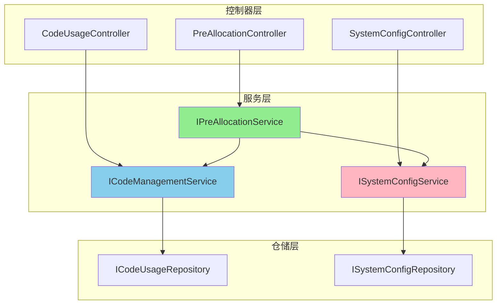

# UML设计图 - 服务层补充

**更新日期**: 2025年8月16日  
**补充内容**: IPreAllocationService接口定义及相关依赖关系  

---

## 业务服务类图（补充版）

### 2.4 业务服务类图（完整版，包含PreAllocationService）

```mermaid
classDiagram
    class IUserService {
        <<interface>>
        +Task~User~ AuthenticateAsync(string employeeId, string password)
        +Task~IEnumerable~User~~ GetUsersAsync()
        +Task~User~ CreateUserAsync(CreateUserDto dto)
        +Task~User~ UpdateUserAsync(int id, UpdateUserDto dto)
        +Task DeleteUserAsync(int id)
    }
    
    class UserService {
        -IUserRepository _userRepository
        -IJwtTokenService _jwtTokenService
        -IPasswordHasher _passwordHasher
        +Task~User~ AuthenticateAsync(string employeeId, string password)
        +Task~IEnumerable~User~~ GetUsersAsync()
        +Task~User~ CreateUserAsync(CreateUserDto dto)
        +Task~User~ UpdateUserAsync(int id, UpdateUserDto dto)
        +Task DeleteUserAsync(int id)
    }
    
    class ICodeManagementService {
        <<interface>>
        +Task~IEnumerable~ProductType~~ GetProductTypesAsync()
        +Task~IEnumerable~ModelClassification~~ GetModelClassificationsAsync(int productTypeId)
        +Task~IEnumerable~CodeClassification~~ GetCodeClassificationsAsync(int modelId)
        +Task~PagedResult~CodeUsageEntry~~ GetCodeUsageListAsync(QueryDto dto)
        +Task~CodeUsageEntry~ CreateCodeUsageAsync(CreateUsageDto dto)
        +Task~CodeUsageEntry~ UpdateCodeUsageAsync(int id, UpdateUsageDto dto)
        +Task DeleteCodeUsageAsync(int id)
        +Task~bool~ CheckCodeExistsAsync(string fullCode)
    }
    
    class CodeManagementService {
        -ICodeUsageRepository _codeUsageRepository
        -IModelClassificationRepository _modelRepository
        -ICodeClassificationRepository _classRepository
        -ICodeValidationService _validationService
        -IAuditLogService _auditService
        +Task~IEnumerable~ProductType~~ GetProductTypesAsync()
        +Task~IEnumerable~ModelClassification~~ GetModelClassificationsAsync(int productTypeId)
        +Task~IEnumerable~CodeClassification~~ GetCodeClassificationsAsync(int modelId)
        +Task~PagedResult~CodeUsageEntry~~ GetCodeUsageListAsync(QueryDto dto)
        +Task~CodeUsageEntry~ CreateCodeUsageAsync(CreateUsageDto dto)
        +Task~CodeUsageEntry~ UpdateCodeUsageAsync(int id, UpdateUsageDto dto)
        +Task DeleteCodeUsageAsync(int id)
        +Task~bool~ CheckCodeExistsAsync(string fullCode)
    }
    
    class IPreAllocationService {
        <<interface>>
        +Task PreAllocateCodesAsync(string modelType, int classificationId, string classificationCode)
        +Task~bool~ CreateManualCodeAsync(string modelType, string numberPart, string extension, CreateCodeDto dto)
        +Task~ValidationResult~ ValidateCodeFormatAsync(string modelType, string numberPart, string extension)
        +Task~ValidationResult~ ValidateManualCodeFormatAsync(string modelType, string numberPart, string extension)
        +Task~IEnumerable~CodeUsageEntry~~ GetAvailableCodesAsync(int? classificationId)
        +Task~bool~ AllocateCodeAsync(int codeUsageId, AllocateCodeDto dto)
        +Task~bool~ UpdateOccupancyTypeAsync(int codeUsageId, string occupancyType)
        +Task~int~ GetCurrentNumberDigitsAsync()
        +Task~char[]~ GetExcludedCharsAsync()
        +Task~char[]~ GetAvailableExtensionCharsAsync()
        +Task~int~ GetExtensionMaxLengthAsync()
    }
    
    class PreAllocationService {
        -ISqlSugarClient _db
        -ILogger _logger
        -ISystemConfigService _configService
        -ICodeValidationService _validationService
        -ICodeManagementService _codeManagementService
        -IEventBus _eventBus
        +Task PreAllocateCodesAsync(string modelType, int classificationId, string classificationCode)
        +Task~bool~ CreateManualCodeAsync(string modelType, string numberPart, string extension, CreateCodeDto dto)
        +Task~ValidationResult~ ValidateCodeFormatAsync(string modelType, string numberPart, string extension)
        +Task~ValidationResult~ ValidateManualCodeFormatAsync(string modelType, string numberPart, string extension)
        +Task~IEnumerable~CodeUsageEntry~~ GetAvailableCodesAsync(int? classificationId)
        +Task~bool~ AllocateCodeAsync(int codeUsageId, AllocateCodeDto dto)
        +Task~bool~ UpdateOccupancyTypeAsync(int codeUsageId, string occupancyType)
        +Task~int~ GetCurrentNumberDigitsAsync()
        +Task~char[]~ GetExcludedCharsAsync()
        +Task~char[]~ GetAvailableExtensionCharsAsync()
        +Task~int~ GetExtensionMaxLengthAsync()
        -int ExtractNumberFromCode(string code)
        -Task LogPreAllocationAsync(string modelType, int classificationId, int classificationNumber, int count, int digits, string startCode, string endCode)
        -Task PublishOccupancyTypeChangedEvent(int codeUsageId, string occupancyType)
    }
    
    class IAnalyticsService {
        <<interface>>
        +Task~DashboardSummaryDto~ GetDashboardSummaryAsync()
        +Task~IEnumerable~YearlyNewModelsDto~~ GetYearlyNewModelsAsync()
        +Task~IEnumerable~ModelCodeRemainingDto~~ GetModelCodeRemainingAsync()
    }
    
    class IPlanningMonitorService {
        <<interface>>
        +Task CheckPlanningStatusAsync()
        +Task~List~PlanningNotificationDto~~ GetDueNotificationsAsync()
        +Task HandleOccupancyTypeChangedAsync(int codeUsageId, string oldType, string newType)
        +Task~PlanningMonitorConfigDto~ GetMonitorConfigAsync()
        +Task UpdateMonitorConfigAsync(UpdateMonitorConfigDto dto)
    }
    
    class INotificationService {
        <<interface>>
        +Task CreateSystemNotificationAsync(CreateNotificationDto dto)
        +Task~List~SystemNotification~~ GetUnreadNotificationsAsync(int userId)
        +Task~PagedResult~SystemNotificationDto~~ GetUserNotificationsAsync(int userId, NotificationQueryDto dto)
        +Task MarkAsReadAsync(int notificationId, int userId)
        +Task MarkAllAsReadAsync(int userId)
        +Task~int~ GetUnreadCountAsync(int userId)
        +Task SendEmailNotificationAsync(EmailNotificationDto dto)
    }
    
    class IEmailService {
        <<interface>>
        +Task~bool~ SendEmailAsync(string to, string subject, string body)
        +Task~string~ GetRecipientEmailAsync(string requesterName, int createdByUserId)
        +Task~bool~ ValidateEmailAsync(string email)
        +Task~EmailConfig~ GetEmailConfigAsync()
    }
    
    class EmailConfig {
        +string SmtpServer         "从SystemConfigs.SmtpServer读取"
        +int SmtpPort             "从SystemConfigs.SmtpPort读取"
        +string SmtpUsername      "从SystemConfigs.SmtpUsername读取"
        +string SmtpPassword      "从SystemConfigs.SmtpPassword读取"
        +bool EnableSsl           "从SystemConfigs.SmtpEnableSsl读取"
        +string FromAddress       "从SystemConfigs.EmailFromAddress读取"
        +string FromDisplayName   "从SystemConfigs.EmailFromDisplayName读取"
        +int RetryIntervalMinutes "从SystemConfigs.EmailRetryIntervalMinutes读取"
        +int MaxRetryCount        "从SystemConfigs.EmailMaxRetryCount读取"
        +bool EnableEmailNotification "从SystemConfigs.EnableEmailNotification读取"
    }
    
    class IEventBus {
        <<interface>>
        +Task PublishAsync~T~(T eventData) where T : IEvent
        +void Subscribe~T~(Func~T,Task~ handler) where T : IEvent
        +void Unsubscribe~T~() where T : IEvent
    }
    
    class EventBus {
        -Dictionary~Type,List~Func~object,Task~~~ _handlers
        +Task PublishAsync~T~(T eventData) where T : IEvent
        +void Subscribe~T~(Func~T,Task~ handler) where T : IEvent
        +void Unsubscribe~T~() where T : IEvent
    }
    
    class IOccupancyTypeService {
        <<interface>>
        +Task UpdateOccupancyTypeAsync(int codeUsageId, string newOccupancyType)
        +Task HandleOccupancyTypeChangedAsync(OccupancyTypeChangedEvent event)
    }
    
    class OccupancyTypeService {
        -ICodeUsageRepository _codeRepository
        -IPlanningMonitorService _monitorService
        -IEventBus _eventBus
        +Task UpdateOccupancyTypeAsync(int codeUsageId, string newOccupancyType)
        +Task HandleOccupancyTypeChangedAsync(OccupancyTypeChangedEvent event)
    }
    
    class OccupancyTypeChangedEvent {
        +int CodeUsageId
        +string OldOccupancyType
        +string NewOccupancyType
        +DateTime Timestamp
    }
    
    %% 实现关系
    UserService ..|> IUserService
    CodeManagementService ..|> ICodeManagementService
    PreAllocationService ..|> IPreAllocationService
    PlanningMonitorService ..|> IPlanningMonitorService
    NotificationService ..|> INotificationService
    EmailService ..|> IEmailService
    EventBus ..|> IEventBus
    OccupancyTypeService ..|> IOccupancyTypeService
    
    %% 依赖关系
    PreAllocationService --> ICodeManagementService : 使用
    PreAllocationService --> IEventBus : 发布事件
    PreAllocationService --> ICodeValidationService : 验证
    PreAllocationService --> ISystemConfigService : 配置
    OccupancyTypeService --> IEventBus : 发布事件
    OccupancyTypeService --> IPlanningMonitorService : 触发监控
```

## 服务依赖关系说明

### PreAllocationService 的核心依赖：

1. **ICodeManagementService**: 用于检查编码是否存在（CheckCodeExistsAsync方法）
2. **ICodeValidationService**: 用于验证编码格式
3. **ISystemConfigService**: 用于获取系统配置（编号位数、排除字符等）
4. **IEventBus**: 用于发布占用类型变更事件
5. **ISqlSugarClient**: 直接数据库操作

### 控制器与服务的关系：

## 修复说明

1. **添加了完整的 IPreAllocationService 接口定义**
2. **明确了 PreAllocationService 对 ICodeManagementService 的依赖**
3. **补充了服务间的依赖关系图**
4. **与开发组件图中的定义保持一致**