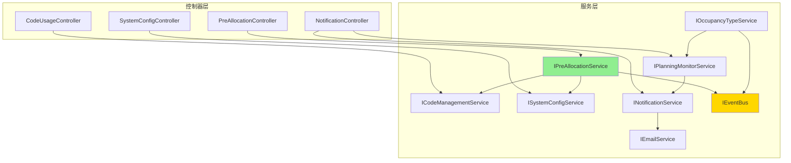

# 机型编码管理系统 - 统一技术规范

**创建日期**: 2025年8月16日  
**文档目的**: 解决文档间的冲突和不一致，提供统一的技术标准  

---

## 📌 核心技术规范

### 1. API路径规范

**统一标准**: 所有API必须使用 `/api/v1/` 前缀

```csharp
[ApiController]
[Route("api/v1/[controller]")]  // ✅ 正确格式
```

### 2. ModelClassification 关联字段规范

**问题**: 前端使用字符串，后端使用整数ID  
**解决方案**:

```csharp
// 数据库实体
public class ModelClassification
{
    public int Id { get; set; }
    public string Type { get; set; }
    public string Name { get; set; }
    public int ProductTypeId { get; set; }  // 数据库使用ID关联
    
    // 导航属性
    public ProductType ProductType { get; set; }
}

// API响应DTO
public class ModelClassificationDto
{
    public int Id { get; set; }
    public string Type { get; set; }
    public string Name { get; set; }
    public string ProductType { get; set; }  // API返回Code字符串供前端使用
    public bool HasCodeClassification { get; set; }
}

// 转换逻辑
public async Task<ModelClassificationDto> GetModelClassificationAsync(int id)
{
    var entity = await _db.Queryable<ModelClassification>()
        .Includes(x => x.ProductType)
        .FirstAsync(x => x.Id == id);
        
    return new ModelClassificationDto
    {
        Id = entity.Id,
        Type = entity.Type,
        Name = entity.Name,
        ProductType = entity.ProductType.Code,  // 返回Code而非ID
        HasCodeClassification = entity.HasCodeClassification
    };
}
```

---

## 📊 状态转换规则（权威定义）

### 占用类型与监控状态

**占用类型** (OccupancyType): 中文硬编码值，用于业务显示
- `规划`
- `暂停`
- `工令`

**监控状态** (MonitorStatus): 英文枚举值，用于系统处理
- `Active`
- `Paused`
- `Stopped`

### 状态转换矩阵

| 原状态 | 新状态 | MonitorStatus变化 | MonitorStartTime | StopReason |
|--------|--------|-------------------|------------------|------------|
| 规划 | 暂停 | Active → Paused | 保留原值 | NULL |
| 规划 | 工令 | Active → Stopped | 保留原值 | "状态变更为工令" |
| 暂停 | 规划 | Paused → Active | 重置为当前时间 | NULL |
| 暂停 | 工令 | Paused → Stopped | 保留原值 | "状态变更为工令" |
| 工令 | 规划 | 创建新记录，Active | 当前时间 | NULL |
| 工令 | 暂停 | 创建新记录，Paused | 当前时间 | NULL |

### 实现代码

```csharp
public class OccupancyTypeService : IOccupancyTypeService
{
    public async Task HandleOccupancyTypeChangedAsync(int codeUsageId, string oldType, string newType)
    {
        var monitorLog = await GetOrCreateMonitorLogAsync(codeUsageId);
        
        switch ((oldType, newType))
        {
            case ("规划", "暂停"):
                monitorLog.MonitorStatus = "Paused";
                // MonitorStartTime 保持不变
                monitorLog.StopReason = null;
                break;
                
            case ("规划", "工令"):
                monitorLog.MonitorStatus = "Stopped";
                // MonitorStartTime 保持不变
                monitorLog.StopReason = "状态变更为工令";
                break;
                
            case ("暂停", "规划"):
                monitorLog.MonitorStatus = "Active";
                monitorLog.MonitorStartTime = DateTime.Now;  // 重置时间
                monitorLog.StopReason = null;
                break;
                
            case ("暂停", "工令"):
                monitorLog.MonitorStatus = "Stopped";
                // MonitorStartTime 保持不变
                monitorLog.StopReason = "状态变更为工令";
                break;
                
            case ("工令", "规划"):
            case ("工令", "暂停"):
                // 创建新监控记录
                await CreateNewMonitorLogAsync(codeUsageId, 
                    newType == "规划" ? "Active" : "Paused");
                return;
        }
        
        monitorLog.UpdatedAt = DateTime.Now;
        await _db.Updateable(monitorLog).ExecuteCommandAsync();
    }
}
```

---

## 🚌 事件总线完整定义

### 核心接口

```csharp
public interface IEvent
{
    DateTime Timestamp { get; }
}

public interface IEventBus
{
    Task PublishAsync<T>(T eventData) where T : IEvent;
    void Subscribe<T>(Func<T, Task> handler) where T : IEvent;
    void Unsubscribe<T>() where T : IEvent;
}
```

### 事件定义

```csharp
// 占用类型变更事件
public class OccupancyTypeChangedEvent : IEvent
{
    public int CodeUsageId { get; set; }
    public string OldOccupancyType { get; set; }     // 中文: 规划/暂停/工令
    public string NewOccupancyType { get; set; }     // 中文: 规划/暂停/工令
    public string OldMonitorStatus { get; set; }     // 英文: Active/Paused/Stopped
    public string NewMonitorStatus { get; set; }     // 英文: Active/Paused/Stopped
    public int ChangedBy { get; set; }
    public DateTime Timestamp { get; set; }
}

// 编码分配事件
public class CodeAllocatedEvent : IEvent
{
    public int CodeUsageId { get; set; }
    public string Model { get; set; }                // 完整编码
    public string AllocatedTo { get; set; }          // 分配给谁
    public int AllocatedBy { get; set; }
    public DateTime AllocatedAt { get; set; }
    public DateTime Timestamp { get; set; }
}

// 规划超时事件
public class PlanningTimeoutEvent : IEvent
{
    public int CodeUsageId { get; set; }
    public string Model { get; set; }                // 完整编码
    public int DurationMonths { get; set; }          // 超时时长（月）
    public string RequesterName { get; set; }        // 需求人姓名
    public string RequesterEmail { get; set; }       // 需求人邮箱
    public DateTime TimeoutAt { get; set; }
    public DateTime Timestamp { get; set; }
}
```

### EventBus 实现

```csharp
public class EventBus : IEventBus
{
    private readonly Dictionary<Type, List<Func<object, Task>>> _handlers = new();
    private readonly ILogger<EventBus> _logger;
    
    public EventBus(ILogger<EventBus> logger)
    {
        _logger = logger;
    }
    
    public async Task PublishAsync<T>(T eventData) where T : IEvent
    {
        var eventType = typeof(T);
        
        _logger.LogInformation($"Publishing event {eventType.Name}");
        
        if (_handlers.TryGetValue(eventType, out var handlers))
        {
            var tasks = handlers.Select(handler => handler(eventData));
            await Task.WhenAll(tasks);
        }
    }
    
    public void Subscribe<T>(Func<T, Task> handler) where T : IEvent
    {
        var eventType = typeof(T);
        
        if (!_handlers.ContainsKey(eventType))
        {
            _handlers[eventType] = new List<Func<object, Task>>();
        }
        
        _handlers[eventType].Add(async (obj) => await handler((T)obj));
    }
    
    public void Unsubscribe<T>() where T : IEvent
    {
        _handlers.Remove(typeof(T));
    }
}
```

---

## 📧 RequesterUserMapping 邮箱优先级（统一逻辑）

### 邮箱获取优先级顺序

1. **查询 RequesterUserMapping 表**
   - 如果 `UserId` 不为空且 `IsIgnored = false`：使用 `Users.Email`
   - 如果 `UserId` 为空但 `Email` 不为空且 `IsIgnored = false`：使用 `Email` 字段

2. **通过姓名匹配 Users 表**
   - 如果找到匹配用户：使用该用户的 `Email`，并自动创建映射

3. **使用建档人邮箱**
   - 从 `CreatedBy` 字段获取用户，使用其 `Email`

4. **仅发送系统通知**
   - 如果所有邮箱都不可用，仅创建系统通知

### 实现代码

```csharp
public class EmailService : IEmailService
{
    public async Task<string> GetRecipientEmailAsync(string requesterName, int createdByUserId)
    {
        // 1. 查询映射表
        var mapping = await _db.Queryable<RequesterUserMapping>()
            .Where(m => m.RequesterName == requesterName && 
                       m.IsActive && 
                       !m.IsIgnored)
            .FirstAsync();
            
        if (mapping != null)
        {
            // 1.1 优先使用系统用户邮箱
            if (mapping.UserId.HasValue)
            {
                var user = await _db.Queryable<User>()
                    .Where(u => u.Id == mapping.UserId.Value)
                    .FirstAsync();
                    
                if (user != null && !string.IsNullOrEmpty(user.Email))
                {
                    _logger.LogInformation($"使用需求人系统用户邮箱: {user.Email}");
                    return user.Email;
                }
            }
            
            // 1.2 使用独立邮箱
            if (!string.IsNullOrEmpty(mapping.Email))
            {
                _logger.LogInformation($"使用需求人独立邮箱: {mapping.Email}");
                return mapping.Email;
            }
        }
        
        // 2. 尝试通过姓名匹配用户
        var matchedUser = await _db.Queryable<User>()
            .Where(u => u.Name == requesterName && u.IsActive)
            .FirstAsync();
            
        if (matchedUser != null && !string.IsNullOrEmpty(matchedUser.Email))
        {
            // 自动创建映射关系
            await CreateUserMappingAsync(requesterName, matchedUser.Id);
            _logger.LogInformation($"通过姓名匹配找到用户邮箱: {matchedUser.Email}");
            return matchedUser.Email;
        }
        
        // 3. 使用建档人邮箱
        var createdByUser = await _db.Queryable<User>()
            .Where(u => u.Id == createdByUserId)
            .FirstAsync();
            
        if (createdByUser != null && !string.IsNullOrEmpty(createdByUser.Email))
        {
            _logger.LogInformation($"使用建档人邮箱: {createdByUser.Email}");
            return createdByUser.Email;
        }
        
        // 4. 无可用邮箱
        _logger.LogWarning($"未找到可用邮箱，需求人: {requesterName}");
        return null;
    }
    
    private async Task CreateUserMappingAsync(string requesterName, int userId)
    {
        var mapping = new RequesterUserMapping
        {
            RequesterName = requesterName,
            UserId = userId,
            IsActive = true,
            IsIgnored = false,
            CreatedAt = DateTime.Now
        };
        
        await _db.Insertable(mapping).ExecuteCommandAsync();
    }
}
```

---

## 📋 编码使用记录表字段规范

### CodeUsageEntries 表结构

```sql
CREATE TABLE CodeUsageEntries (
    Id INT PRIMARY KEY IDENTITY,
    Model NVARCHAR(50) NOT NULL,             -- 完整编码: SLU-105A, SLU-001A
    CodeNumber NVARCHAR(10) NOT NULL,        -- 编码数字部分: 105(3层), 001(2层)
    Extension NVARCHAR(10),                  -- 延伸码: A, AB, ABC (可选)
    ClassificationNumber INT NULL,           -- 代码分类数字: 1,2,3 (2层结构时为NULL)
    ActualNumber NVARCHAR(10) NOT NULL,      -- 纯编号部分: 05(3层), 001(2层)
    
    -- 业务字段
    ProductName NVARCHAR(200),               -- 品名（预分配时为NULL）
    Description TEXT,                        -- 说明（预分配时为NULL）
    OccupancyType NVARCHAR(20),             -- 占用类型: '规划'/'暂停'/'工令'
    CustomerId INT,                         -- 客户ID
    FactoryId INT,                          -- 厂区ID
    Builder NVARCHAR(100),                  -- 建档人
    Requester NVARCHAR(100),                -- 需求人
    CreationDate DATE,                      -- 创建日期
    
    -- 状态字段
    IsAllocated BIT DEFAULT 0,              -- 0=预分配，1=已使用
    IsDeleted BIT DEFAULT 0,                -- 软删除标记
    DeletedReason NVARCHAR(200),            -- 删除原因
    
    -- 关联字段
    CodeClassificationId INT,               -- 代码分类ID (2层结构时为NULL)
    NumberDigits INT NOT NULL,              -- 创建时的编号位数
    
    -- 审计字段
    CreatedBy INT,                          -- 创建用户ID
    CreatedAt DATETIME2 DEFAULT GETDATE(),  -- 创建时间
    UpdatedAt DATETIME2 DEFAULT GETDATE()   -- 更新时间
);
```

### 字段说明

1. **CodeNumber**: 统一长度 NVARCHAR(10)，存储完整的数字部分
   - 3层结构: "105" (分类1 + 编号05)
   - 2层结构: "001" (纯编号)

2. **ClassificationNumber**: 代码分类数字
   - 3层结构: 1, 2, 3...
   - 2层结构: NULL

3. **ActualNumber**: 实际编号部分
   - 3层结构: "05" (从CodeNumber中提取)
   - 2层结构: "001" (与CodeNumber相同)

4. **OccupancyType**: 中文硬编码值
   - 仅使用: '规划', '暂停', '工令'
   - 用于业务显示和逻辑判断

---

## 🔄 服务依赖关系总结



---

## 📝 使用说明

1. **所有新开发的代码必须遵循本规范**
2. **如有冲突，以本文档为准**
3. **本文档将持续更新，作为技术标准的唯一来源**
4. **各开发人员应定期查阅本文档确保一致性**

---

**文档维护**: 技术负责人  
**最后更新**: 2025年8月16日  
**版本**: v1.0