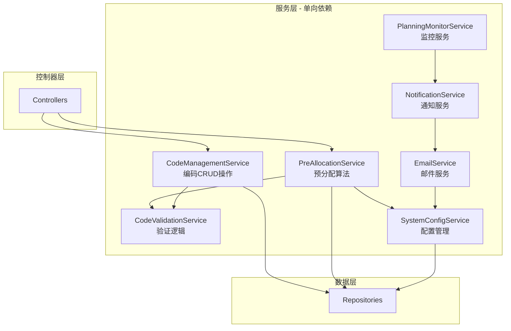

# 机型编码管理系统 - 统一设计规范文档

**文档版本**: v1.0  
**创建日期**: 2025年8月16日  
**目的**: 解决设计文档中的逻辑冲突，提供统一的实现标准

---

## 📋 目录

1. [服务层依赖关系规范](#1-服务层依赖关系规范)
2. [数据模型字段命名规范](#2-数据模型字段命名规范)
3. [配置管理架构规范](#3-配置管理架构规范)
4. [状态管理规范](#4-状态管理规范)
5. [API设计规范](#5-api设计规范)
6. [监控服务实现规范](#6-监控服务实现规范)

---

## 1. 服务层依赖关系规范

### 1.1 服务职责定义



### 1.2 服务接口定义

```csharp
// 编码管理服务 - 负责编码的CRUD操作
public interface ICodeManagementService
{
    Task<CodeUsageEntry> CreateCodeUsageAsync(CreateUsageDto dto);
    Task<CodeUsageEntry> UpdateCodeUsageAsync(int id, UpdateUsageDto dto);
    Task DeleteCodeUsageAsync(int id);
    Task<bool> AllocateCodeAsync(int codeUsageId, AllocateCodeDto dto);
    Task<IEnumerable<CodeUsageEntry>> GetAvailableCodesAsync(int? classificationId);
}

// 预分配服务 - 负责批量生成预分配编码
public interface IPreAllocationService
{
    Task<List<CodeUsageEntry>> GeneratePreAllocatedCodesAsync(PreAllocationDto dto);
    Task<bool> CreateManualCodeAsync(ManualCodeDto dto);
    // 注意：不调用CodeManagementService，直接操作Repository
}

// 验证服务 - 共享的验证逻辑
public interface ICodeValidationService
{
    Task<ValidationResult> ValidateCodeFormatAsync(string model);
    Task<bool> IsCodeUniqueAsync(string model);
    Task<bool> ValidateExtensionAsync(string extension);
}
```

---

## 2. 数据模型字段命名规范

### 2.1 统一字段定义

```csharp
public class CodeUsageEntry
{
    public int Id { get; set; }
    
    // 核心编码字段
    public string Model { get; set; }              // 完整编码: "SLU-105A"
    public string ModelType { get; set; }          // 机型前缀: "SLU-"
    public string NumberPart { get; set; }         // 数字部分: "105" (3层) 或 "001" (2层)
    public string Extension { get; set; }          // 延伸码: "A"
    
    // 3层结构专用字段
    public int? ClassificationNumber { get; set; } // 代码分类编号: 1
    public string ActualNumber { get; set; }       // 实际编号: "05"
    public int? CodeClassificationId { get; set; } // 代码分类ID (2层时为NULL)
    
    // 业务字段
    public string ProductName { get; set; }        // 品名
    public string CustomerName { get; set; }       // 客户名称
    public string RequesterName { get; set; }      // 需求人姓名
    public string OccupancyType { get; set; }      // 占用类型: "规划"/"暂停"/"工令"
    public string Description { get; set; }        // 说明
    
    // 状态字段
    public bool IsAllocated { get; set; }          // 是否已分配
    public bool IsDeleted { get; set; }            // 软删除标记
    public int NumberDigits { get; set; }          // 创建时的编号位数
    
    // 监控字段
    public string MonitorStatus { get; set; }      // 监控状态: "Active"/"Paused"/"Stopped"
    public DateTime? MonitorStartTime { get; set; } // 监控开始时间
    public string StopReason { get; set; }         // 停止原因
    
    // 审计字段
    public int CreatedBy { get; set; }
    public DateTime CreatedAt { get; set; }
    public int? UpdatedBy { get; set; }
    public DateTime? UpdatedAt { get; set; }
}
```

### 2.2 字段映射关系

| 业务概念 | 数据库字段 | 说明 |
|---------|-----------|------|
| 完整编码 | Model | 如 "SLU-105A" |
| 机型前缀 | ModelType | 如 "SLU-" |
| 数字部分 | NumberPart | 包含分类号的数字，如 "105" |
| 实际编号 | ActualNumber | 不含分类号的纯编号，如 "05" |
| 延伸码 | Extension | 可选的字母后缀，如 "A" |

---

## 3. 配置管理架构规范

### 3.1 配置服务架构

```csharp
// 系统配置服务 - 所有配置的统一入口
public interface ISystemConfigService
{
    // 通用配置
    Task<T> GetConfigAsync<T>(string key);
    Task UpdateConfigAsync(string key, string value);
    
    // 专用配置方法
    Task<int> GetNumberDigitsAsync();
    Task<int> GetExtensionMaxLengthAsync();
    Task<char[]> GetExcludedCharsAsync();
    
    // 邮件配置 - EmailService通过此方法获取
    Task<EmailConfig> GetEmailConfigAsync();
    
    // 监控配置
    Task<MonitorConfig> GetMonitorConfigAsync();
}

// 邮件服务 - 不直接访问配置表
public class EmailService : IEmailService
{
    private readonly ISystemConfigService _configService;
    
    public EmailService(ISystemConfigService configService)
    {
        _configService = configService;
    }
    
    private async Task<EmailConfig> GetConfigAsync()
    {
        // 通过SystemConfigService获取配置
        return await _configService.GetEmailConfigAsync();
    }
}
```

### 3.2 配置表结构

```sql
-- 系统配置表（全局唯一配置源）
CREATE TABLE SystemConfigs (
    Id INT PRIMARY KEY IDENTITY,
    ConfigKey NVARCHAR(50) NOT NULL UNIQUE,
    ConfigValue NVARCHAR(500),
    ConfigType NVARCHAR(20),  -- 'System', 'Email', 'Monitor'
    Description NVARCHAR(200),
    IsActive BIT DEFAULT 1,
    UpdatedBy INT,
    UpdatedAt DATETIME2 DEFAULT GETDATE()
);
```

---

## 4. 状态管理规范

### 4.1 状态值定义

```csharp
// 占用类型枚举（业务显示）
public static class OccupancyTypes
{
    public const string Planning = "规划";
    public const string Paused = "暂停";
    public const string WorkOrder = "工令";
}

// 监控状态枚举（系统处理）
public enum MonitorStatus
{
    Active,   // 活跃监控中
    Paused,   // 暂停监控
    Stopped   // 停止监控
}

// 状态映射器
public static class StatusMapper
{
    private static readonly Dictionary<string, MonitorStatus> _map = new()
    {
        [OccupancyTypes.Planning] = MonitorStatus.Active,
        [OccupancyTypes.Paused] = MonitorStatus.Paused,
        [OccupancyTypes.WorkOrder] = MonitorStatus.Stopped
    };
    
    public static MonitorStatus ToMonitorStatus(string occupancyType)
    {
        return _map.GetValueOrDefault(occupancyType, MonitorStatus.Stopped);
    }
}
```

### 4.2 状态转换规则

```csharp
public class OccupancyTypeService : IOccupancyTypeService
{
    public async Task HandleStatusChangeAsync(int codeUsageId, string oldType, string newType)
    {
        var transitions = new Dictionary<(string, string), Action<CodeUsageEntry>>
        {
            // 规划 → 暂停
            [(OccupancyTypes.Planning, OccupancyTypes.Paused)] = (entry) =>
            {
                entry.MonitorStatus = MonitorStatus.Paused.ToString();
                // 保留MonitorStartTime，不重置
                entry.StopReason = null;
            },
            
            // 规划 → 工令
            [(OccupancyTypes.Planning, OccupancyTypes.WorkOrder)] = (entry) =>
            {
                entry.MonitorStatus = MonitorStatus.Stopped.ToString();
                entry.StopReason = "状态变更为工令";
                // 保留MonitorStartTime作为历史记录
            },
            
            // 暂停 → 规划
            [(OccupancyTypes.Paused, OccupancyTypes.Planning)] = (entry) =>
            {
                entry.MonitorStatus = MonitorStatus.Active.ToString();
                entry.MonitorStartTime = DateTime.Now; // 重置开始时间
                entry.StopReason = null;
            },
            
            // 暂停 → 工令
            [(OccupancyTypes.Paused, OccupancyTypes.WorkOrder)] = (entry) =>
            {
                entry.MonitorStatus = MonitorStatus.Stopped.ToString();
                entry.StopReason = "状态变更为工令";
            },
            
            // 工令 → 规划（创建新监控）
            [(OccupancyTypes.WorkOrder, OccupancyTypes.Planning)] = (entry) =>
            {
                entry.MonitorStatus = MonitorStatus.Active.ToString();
                entry.MonitorStartTime = DateTime.Now;
                entry.StopReason = null;
            },
            
            // 工令 → 暂停（创建新监控）
            [(OccupancyTypes.WorkOrder, OccupancyTypes.Paused)] = (entry) =>
            {
                entry.MonitorStatus = MonitorStatus.Paused.ToString();
                entry.MonitorStartTime = DateTime.Now;
                entry.StopReason = null;
            }
        };
        
        if (transitions.TryGetValue((oldType, newType), out var transition))
        {
            // 执行状态转换
            var entry = await GetCodeUsageEntryAsync(codeUsageId);
            transition(entry);
            await UpdateCodeUsageEntryAsync(entry);
            
            // 发布状态变更事件
            await PublishStatusChangeEventAsync(codeUsageId, oldType, newType);
        }
    }
}
```

---

## 5. API设计规范

### 5.1 路由命名规范

**统一使用kebab-case命名风格**

```csharp
// ✅ 正确的路由命名
[Route("api/v1/product-types")]
[Route("api/v1/model-classifications")]
[Route("api/v1/code-classifications")]
[Route("api/v1/code-usage")]
[Route("api/v1/pre-allocation")]
[Route("api/v1/system-configs")]
[Route("api/v1/planning-monitor")]
[Route("api/v1/data-dictionary")]

// ❌ 错误的路由命名
[Route("api/v1/productTypes")]      // 驼峰命名
[Route("api/v1/ProductTypes")]      // Pascal命名
[Route("api/v1/product_types")]     // 下划线命名
```

### 5.2 RESTful动词规范

```csharp
[ApiController]
[Route("api/v1/code-usage")]
public class CodeUsageController : BaseController
{
    [HttpGet]                      // 获取列表
    [HttpGet("{id}")]             // 获取单个
    [HttpPost]                    // 创建
    [HttpPut("{id}")]            // 更新
    [HttpDelete("{id}")]         // 删除
    [HttpPost("{id}/allocate")]  // 自定义操作
}
```

### 5.3 响应格式规范

```csharp
public class ApiResult<T>
{
    public bool Success { get; set; }
    public T Data { get; set; }
    public string Message { get; set; }
    public string TraceId { get; set; }
    public DateTime Timestamp { get; set; }
    public ApiError Error { get; set; }
}

public class ApiError
{
    public string Code { get; set; }
    public string Message { get; set; }
    public Dictionary<string, string[]> Details { get; set; }
}
```

---

## 6. 监控服务实现规范

### 6.1 HostedService实现

```csharp
public class PlanningMonitorHostedService : IHostedService, IDisposable
{
    private Timer _timer;
    private readonly IServiceProvider _serviceProvider;
    private readonly ILogger<PlanningMonitorHostedService> _logger;
    
    public PlanningMonitorHostedService(
        IServiceProvider serviceProvider,
        ILogger<PlanningMonitorHostedService> logger)
    {
        _serviceProvider = serviceProvider;
        _logger = logger;
    }
    
    public Task StartAsync(CancellationToken cancellationToken)
    {
        _logger.LogInformation("规划监控服务启动");
        
        // 每24小时执行一次检查
        _timer = new Timer(DoWork, null, TimeSpan.Zero, TimeSpan.FromHours(24));
        
        return Task.CompletedTask;
    }
    
    private async void DoWork(object state)
    {
        using (var scope = _serviceProvider.CreateScope())
        {
            var monitorService = scope.ServiceProvider
                .GetRequiredService<IPlanningMonitorService>();
            
            try
            {
                await monitorService.CheckPlanningStatusAsync();
            }
            catch (Exception ex)
            {
                _logger.LogError(ex, "规划监控检查失败");
            }
        }
    }
    
    public Task StopAsync(CancellationToken cancellationToken)
    {
        _logger.LogInformation("规划监控服务停止");
        _timer?.Change(Timeout.Infinite, 0);
        return Task.CompletedTask;
    }
    
    public void Dispose()
    {
        _timer?.Dispose();
    }
}
```

### 6.2 服务注册

```csharp
// Program.cs
public class Program
{
    public static void Main(string[] args)
    {
        var builder = WebApplication.CreateBuilder(args);
        
        // 注册监控服务
        builder.Services.AddScoped<IPlanningMonitorService, PlanningMonitorService>();
        builder.Services.AddScoped<INotificationService, NotificationService>();
        builder.Services.AddScoped<IEmailService, EmailService>();
        
        // 注册HostedService
        builder.Services.AddHostedService<PlanningMonitorHostedService>();
        
        var app = builder.Build();
        // ...
    }
}
```

---

## 📊 修复影响范围

### 需要更新的文件
1. ✅ 统一设计规范文档.md（本文档）
2. ⏳ 开发组件图.md - 更新服务依赖关系
3. ⏳ 项目文档.md - 更新字段命名和配置说明
4. ⏳ 编码规则配置设计.md - 统一字段命名
5. ⏳ 流程图与时序图.md - 更新状态转换流程

### 实施优先级
1. **立即执行**：采用本文档的规范进行开发
2. **开发前更新**：更新其他设计文档保持一致
3. **持续维护**：开发过程中发现新冲突及时更新

---

**文档状态**: 完成  
**创建人**: 系统架构师  
**创建日期**: 2025-08-16  
**下次更新**: 根据开发反馈调整