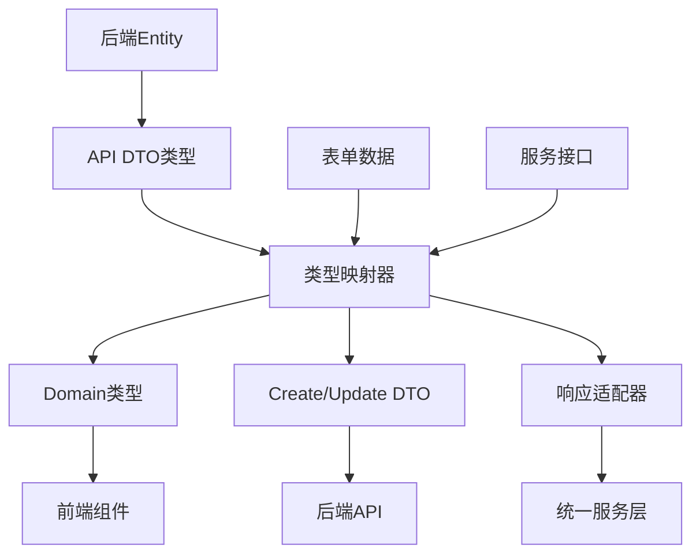

# TypeScript 类型系统架构文档

## 概述

本项目采用三层类型系统架构，实现前后端数据结构的精确映射和类型安全保证：

- **API层 (DTO)**: 严格对应后端Entity结构的数据传输对象
- **Domain层**: 优化用于前端UI展示和交互的领域模型  
- **Mapping层**: API DTO与Domain类型之间的双向映射系统

## 架构图



## 目录结构

```
src/types/
├── README.md                    # 本文档
├── index.ts                    # 统一类型导出入口
├── api.ts                      # 后端API数据传输对象类型
├── domain.ts                   # 前端领域类型定义
├── mappers.ts                  # 类型映射系统
└── services/
    └── index.ts               # 服务接口类型定义
```

## 类型层详解

### 1. API层 (api.ts) - 后端数据契约

严格对应后端Entity和DTO结构，保证数据传输的准确性：

```typescript
// 示例：产品类型DTO (与后端ProductType.cs完全对应)
export interface ProductTypeDto {
  id: number;                    // 后端主键ID
  code: string;                  // Required, MaxLength(20)
  createdAt: string;             // DateTime，ISO字符串格式
  // 关联数据
  modelClassifications?: ModelClassificationDto[];
}

export interface ProductTypeCreateDto {
  code: string;                  // 创建时只需要code字段
}

export interface ProductTypeUpdateDto {
  id: number;                    // 更新时需要ID
  code: string;
}
```

**特点**：
- 字段名严格匹配后端Entity属性
- 数据类型精确对应后端数据类型
- 包含完整的关联关系定义
- 支持Create/Update/Response等不同场景的DTO变体

### 2. Domain层 (domain.ts) - 前端业务模型

针对前端UI展示和交互优化的领域模型：

```typescript
// 示例：产品类型领域模型
export interface ProductType {
  id: string;                    // 前端统一使用string类型ID
  code: string;
  createdAt: string;             // 格式化后的日期字符串
  displayName: string;           // 显示名称 (computed)
  isNew: boolean;                // 是否新创建 (computed，7天内)
  
  // 统计信息 (computed)
  modelClassificationCount?: number;
  
  // 关联数据 (按需加载)
  modelClassifications?: ModelClassification[];
}

export interface ProductTypeFormData {
  code: string;
  displayName?: string;          // 表单辅助字段
}

export interface ProductTypeListItem extends ProductType {
  summary: {                     // 列表页显示摘要
    modelClassificationCount: number;
    codeUsageCount: number;
    lastModified: string;
  };
}
```

**特点**：
- 所有ID统一为string类型，便于前端处理
- 包含computed字段，减少组件计算负担
- 针对不同使用场景提供专用类型 (FormData, ListItem)
- 丰富的显示辅助字段

### 3. Mapping层 (mappers.ts) - 类型转换桥梁

提供API DTO与Domain类型之间的双向映射：

```typescript
export class ProductTypeMapper {
  /**
   * DTO → Domain
   */
  static toDomain(dto: ProductTypeDto): ProductType {
    return {
      id: TypeMapper.mapId(dto.id),           // number → string
      code: dto.code,
      createdAt: TypeMapper.formatDate(dto.createdAt),  // 日期格式化
      displayName: dto.code,                  // 计算显示名称
      isNew: this.isNewRecord(dto.createdAt), // 计算新记录标识
      modelClassificationCount: dto.modelClassifications?.length ?? 0,
    };
  }

  /**
   * FormData → CreateDTO
   */
  static toCreateDto(formData: ProductTypeFormData): ProductTypeCreateDto {
    return {
      code: formData.code.trim(),             // 数据清理和验证
    };
  }
}
```

**特点**：
- 提供完整的双向映射方法
- 包含数据清理和格式化逻辑
- 统一的错误处理和空值处理
- 支持批量映射和响应包装

## 使用指南

### 1. 服务层使用 (API调用)

```typescript
import { Mappers, ProductTypeDto, ProductType } from '../types';

class ProductTypeService {
  async getById(id: string): Promise<ServiceResponse<ProductType>> {
    // 调用API，返回DTO
    const apiResponse = await this.http.get<ProductTypeDto>(`/product-types/${id}`);
    
    // DTO → Domain映射
    const domain = apiResponse.data ? Mappers.ProductType.toDomain(apiResponse.data) : undefined;
    
    return {
      success: apiResponse.success,
      data: domain,
      error: apiResponse.error,
    };
  }
  
  async create(formData: ProductTypeFormData): Promise<ServiceResponse<ProductType>> {
    // FormData → CreateDTO映射
    const createDto = Mappers.ProductType.toCreateDto(formData);
    
    // 调用API
    const apiResponse = await this.http.post<ProductTypeDto>('/product-types', createDto);
    
    // 返回Domain类型
    return Mappers.Response.mapResponse(apiResponse, Mappers.ProductType.toDomain);
  }
}
```

### 2. 组件层使用 (UI展示)

```typescript
import type { ProductType, ProductTypeListItem } from '../types';

// 列表组件
interface ProductTypeListProps {
  items: ProductTypeListItem[];  // 使用专门的ListItem类型
  onEdit: (item: ProductType) => void;
}

// 详情组件  
interface ProductTypeDetailProps {
  productType: ProductType;      // 使用Domain类型
}

// 表单组件
interface ProductTypeFormProps {
  initialData?: ProductTypeFormData;  // 使用FormData类型
  onSubmit: (data: ProductTypeFormData) => void;
}
```

### 3. 状态管理使用

```typescript
// 推荐：使用Domain类型存储状态
interface AppState {
  productTypes: ProductType[];
  selectedProductType: ProductType | null;
  loading: LoadingState;
}

// 避免：直接存储API返回的DTO
// 这样会在组件中重复进行映射和计算
```

## 类型系统优势

### 1. 类型安全
- 编译时检查所有类型转换
- 避免运行时类型错误
- IDE智能提示和自动补全

### 2. 清晰的职责分离
- API层专注数据传输契约
- Domain层专注业务逻辑表达
- Mapper层处理转换和适配

### 3. 易于维护
- 后端结构变更时，只需更新API层和Mapper
- 前端业务逻辑变更时，只需更新Domain层
- 类型定义即文档

### 4. 性能优化
- Domain层预计算显示字段，减少组件渲染计算
- 支持按需映射，避免不必要的数据处理
- 类型级别的树摇，减少打包体积

## 最佳实践

### 1. 命名约定
```typescript
// DTO类型：严格按照后端命名
interface ProductTypeDto { }

// Domain类型：业务语义命名
interface ProductType { }

// 表单类型：用途明确
interface ProductTypeFormData { }

// 列表类型：场景专用
interface ProductTypeListItem { }
```

### 2. 映射方法命名
```typescript
class SomeMapper {
  static toDomain(dto: SomeDto): SomeDomain { }      // DTO → Domain
  static toCreateDto(form: SomeFormData): SomeCreateDto { }  // Form → CreateDTO  
  static toUpdateDto(id: string, form: SomeFormData): SomeUpdateDto { }  // Form → UpdateDTO
  static toListItem(dto: SomeDto): SomeListItem { }  // DTO → ListItem
}
```

### 3. 错误处理
```typescript
// 统一的错误处理模式
try {
  const apiResponse = await api.get<SomeDto>('/endpoint');
  if (!apiResponse.success) {
    return { success: false, error: apiResponse.error };
  }
  
  const domain = Mapper.toDomain(apiResponse.data!);
  return { success: true, data: domain };
} catch (error) {
  return { success: false, error: this.handleError(error) };
}
```

### 4. 缓存策略
```typescript
// Domain类型优先缓存
const cacheKey = `productType_${id}`;
const cached = cache.get<ProductType>(cacheKey);
if (cached) {
  return { success: true, data: cached, fromCache: true };
}

// API调用后缓存Domain类型
const domain = Mapper.toDomain(dto);
cache.set(cacheKey, domain, 300); // 5分钟TTL
```

## 扩展指南

### 添加新的业务实体

1. **定义API类型** (api.ts)
```typescript
export interface NewEntityDto {
  id: number;
  name: string;
  // ... 其他字段
}

export interface NewEntityCreateDto {
  name: string;
}

export interface NewEntityUpdateDto {
  id: number;
  name: string;
}
```

2. **定义Domain类型** (domain.ts)
```typescript
export interface NewEntity {
  id: string;
  name: string;
  displayName: string;  // computed
  // ... 其他优化字段
}

export interface NewEntityFormData {
  name: string;
}
```

3. **创建映射器** (mappers.ts)
```typescript
export class NewEntityMapper {
  static toDomain(dto: NewEntityDto): NewEntity {
    return {
      id: TypeMapper.mapId(dto.id),
      name: dto.name,
      displayName: dto.name, // 或其他计算逻辑
    };
  }
  
  static toCreateDto(form: NewEntityFormData): NewEntityCreateDto {
    return {
      name: form.name.trim(),
    };
  }
}
```

4. **定义服务接口** (services/types/index.ts)
```typescript
export interface INewEntityService extends 
  ICrudService<NewEntity, NewEntity, NewEntityFormData, NewEntityCreateDto, NewEntityUpdateDto> {
  // 业务特定方法
}
```

5. **更新统一导出** (index.ts)
```typescript
export * from './api';    // 包含新的DTO类型
export * from './domain'; // 包含新的Domain类型
export { Mappers } from './mappers'; // 包含新的映射器
```

## 常见问题

### Q: 为什么要分离API和Domain类型？
A: API类型确保与后端契约的准确性，Domain类型针对前端业务优化。分离后可以独立演化，提高维护性。

### Q: computed字段会不会影响性能？
A: computed字段在映射时计算一次，存储在Domain对象中，组件渲染时直接使用，实际上提升了性能。

### Q: 如何处理后端字段名变更？
A: 只需在API类型和对应的Mapper中修改，Domain类型和组件代码无需改动。

### Q: 是否支持部分映射？
A: 是的，Mapper方法可以接受可选参数控制映射行为，支持按需映射。

---

**创建时间**: 2025年09月01日  
**版本**: v1.0.0  
**状态**: ✅ 类型系统完善完成  
**覆盖范围**: 产品类型、机型分类、代码分类、编码使用记录、用户认证、战情中心、组织架构