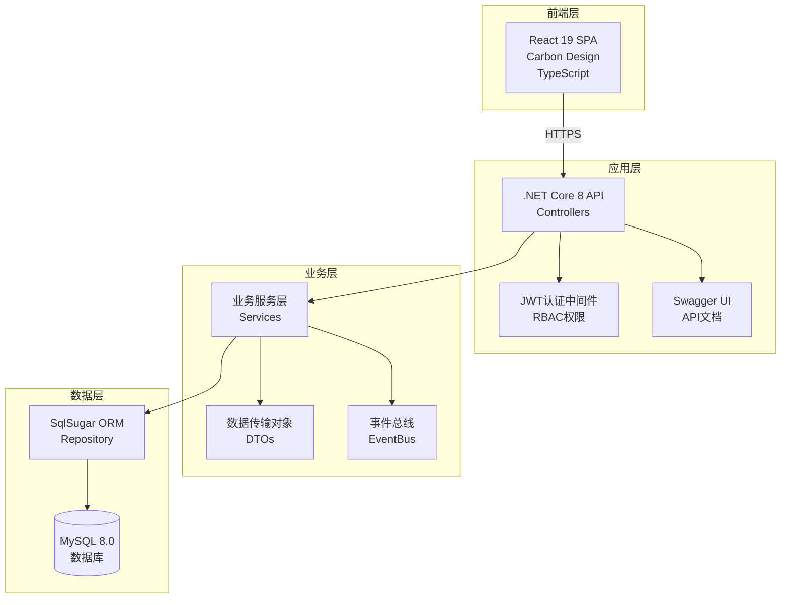

# 机型编码管理系统 - 系统设计文档（完整版-修正）

**文档版本**: v3.0  
**创建日期**: 2025年8月13日  
**更新日期**: 2025年8月16日（修正编码结构理解）  
**技术栈**: C# + .NET Core 8 + SqlSugar + MySQL  

---

## 📋 目录

1. [项目概述](#1-项目概述)
2. [系统架构设计](#2-系统架构设计)
3. [数据库设计](#3-数据库设计)
4. [API设计规范](#4-api设计规范)
5. [核心业务逻辑](#5-核心业务逻辑)
6. [编码规则配置](#6-编码规则配置)
7. [状态管理与监控](#7-状态管理与监控)
8. [服务层设计](#8-服务层设计)
9. [权限管理](#9-权限管理)
10. [部署方案](#10-部署方案)

---

## 1. 项目概述

### 1.1 基本信息
- **项目名称**: 机型编码管理系统
- **业务领域**: 制造业编码管理
- **用户规模**: 总用户200人，同时在线≤20人
- **组织架构**: 台湾/大陆分公司 → 事业部 → 部门 → 课别
- **部署环境**: Windows Server + IIS + 内网

### 1.2 技术栈
```
前端: React 19 + TypeScript + Carbon Design (已完成)
后端: C# + .NET Core 8 + Web API + Swagger UI
认证: JWT Token + RBAC权限
数据: SqlSugar ORM + MySQL 8.0
部署: Windows Server + IIS
```

### 1.3 核心功能

#### 层级结构（重要修正）
**4层层级结构**：
1. **产品类型** (ProductType): PCB、FPC等
2. **机型分类** (ModelClassification): SLU-、SLUR-、SB-、ST-、AC-等
3. **代码分类** (CodeClassification): 1-内层、2-薄板、3-载盘等（可选层）
4. **代码使用清单** (CodeUsageEntry): 具体的编码记录

**两种架构模式**：
- **3层结构**: 产品类型 → 机型分类(hasCodeClassification=true) → 代码分类 → 使用清单
- **2层结构**: 产品类型 → 机型分类(hasCodeClassification=false) → 使用清单

---

## 2. 系统架构设计

### 2.1 整体架构



---

## 3. 数据库设计（修正版）

### 3.1 核心表结构

#### 产品和机型相关表
```sql
-- 产品类型表
CREATE TABLE ProductTypes (
    Id INT PRIMARY KEY IDENTITY,
    Code NVARCHAR(20) NOT NULL UNIQUE,  -- PCB, FPC等
    Name NVARCHAR(100) NOT NULL,
    IsActive BIT DEFAULT 1,
    CreatedAt DATETIME2 DEFAULT GETDATE()
);

-- 机型分类表（重要：这是SLU-、SLUR-等的来源）
CREATE TABLE ModelClassifications (
    Id INT PRIMARY KEY IDENTITY,
    Type NVARCHAR(20) NOT NULL,          -- SLU-, SLUR-, SB-, ST-, AC-等
    Name NVARCHAR(100) NOT NULL,         -- 製程投收料非多軸機械手等
    Description TEXT,                     -- JSON格式的描述数组
    ProductTypeId INT NOT NULL,          -- 关联到ProductTypes
    HasCodeClassification BIT DEFAULT 1, -- 是否有代码分类层（3层/2层结构）
    IsActive BIT DEFAULT 1,
    CreatedAt DATETIME2 DEFAULT GETDATE(),
    FOREIGN KEY (ProductTypeId) REFERENCES ProductTypes(Id)
);

-- 代码分类表（仅3层结构使用）
CREATE TABLE CodeClassifications (
    Id INT PRIMARY KEY IDENTITY,
    Code NVARCHAR(50) NOT NULL,          -- 1-内层, 2-薄板, 3-载盘等
    Name NVARCHAR(100) NOT NULL,
    ModelClassificationId INT NOT NULL,  -- 关联到ModelClassifications
    SortOrder INT,
    IsActive BIT DEFAULT 1,
    CreatedAt DATETIME2 DEFAULT GETDATE(),
    FOREIGN KEY (ModelClassificationId) REFERENCES ModelClassifications(Id)
);

-- 编码使用记录表（核心表）
CREATE TABLE CodeUsageEntries (
    Id INT PRIMARY KEY IDENTITY,
    -- 编码组成部分
    Model NVARCHAR(50) NOT NULL,             -- 完整编码: SLU-105A
    ModelType NVARCHAR(20) NOT NULL,         -- 机型类型: SLU- (来自ModelClassifications.Type)
    CodeClassificationNumber INT NULL,       -- 代码分类数字: 1 (来自"1-内层"，2层结构时为NULL)
    ActualNumber NVARCHAR(10) NOT NULL,      -- 实际编号: 05
    Extension NVARCHAR(10),                  -- 延伸码: A
    
    -- 关联字段
    ModelClassificationId INT NOT NULL,      -- 关联的机型分类
    CodeClassificationId INT NULL,           -- 关联的代码分类(2层结构时为NULL)
    
    -- 业务字段
    ProductName NVARCHAR(200),               -- 品名
    Description TEXT,                        -- 说明
    OccupancyType NVARCHAR(20),             -- 占用类型: '规划'/'暂停'/'工令'
    CustomerId INT,
    FactoryId INT,
    Builder NVARCHAR(100),                  -- 建档人
    Requester NVARCHAR(100),                -- 需求人
    CreationDate DATE,
    
    -- 状态字段
    IsAllocated BIT DEFAULT 0,              -- 0=预分配，1=已使用
    IsDeleted BIT DEFAULT 0,
    DeletedReason NVARCHAR(200),
    NumberDigits INT NOT NULL,              -- 创建时的编号位数
    
    -- 审计字段
    CreatedBy INT,
    CreatedAt DATETIME2 DEFAULT GETDATE(),
    UpdatedAt DATETIME2 DEFAULT GETDATE(),
    
    FOREIGN KEY (ModelClassificationId) REFERENCES ModelClassifications(Id),
    FOREIGN KEY (CodeClassificationId) REFERENCES CodeClassifications(Id)
);

-- 编码预分配日志表
CREATE TABLE CodePreAllocationLogs (
    Id INT PRIMARY KEY IDENTITY,
    ModelClassificationId INT NOT NULL,      -- 机型分类ID
    CodeClassificationId INT NOT NULL,       -- 代码分类ID
    ModelType NVARCHAR(20) NOT NULL,         -- 机型类型(如SLU-)
    ClassificationNumber INT NOT NULL,       -- 代码分类编号(如1)
    AllocationCount INT NOT NULL,            -- 预分配数量
    NumberDigits INT NOT NULL,               -- 使用的编号位数
    StartCode NVARCHAR(50) NOT NULL,         -- 起始编码
    EndCode NVARCHAR(50) NOT NULL,           -- 结束编码
    CreatedBy INT NOT NULL,
    CreatedAt DATETIME2 DEFAULT GETDATE()
);
```

### 3.2 数据示例说明

#### 编码结构分解（修正版）

**3层结构示例: SLU-105A**
```
SLU-105A 分解为:
├── SLU-    : 机型分类Type (来自ModelClassifications表)
├── 1       : 代码分类编号 (来自CodeClassifications "1-内层")
├── 05      : 实际编号
└── A       : 延伸码

数据库存储:
- Model: "SLU-105A"
- ModelType: "SLU-"
- CodeClassificationNumber: 1
- ActualNumber: "05"
- Extension: "A"
- ModelClassificationId: [对应SLU-的ID]
- CodeClassificationId: [对应"1-内层"的ID]
```

**2层结构示例: AC-001B**
```
AC-001B 分解为:
├── AC-     : 机型分类Type (来自ModelClassifications表)
├── 001     : 编号部分
└── B       : 延伸码

数据库存储:
- Model: "AC-001B"
- ModelType: "AC-"
- CodeClassificationNumber: NULL
- ActualNumber: "001"
- Extension: "B"
- ModelClassificationId: [对应AC-的ID]
- CodeClassificationId: NULL
```

---

## 4. API设计规范

### 4.1 统一路径规范

**所有API必须使用 `/api/v1/` 前缀**

### 4.2 主要API端点（修正版）

| 功能模块 | HTTP方法 | 端点路径 | 说明 |
|---------|---------|---------|------|
| 产品类型 | GET | `/api/v1/product-types` | 获取所有产品类型 |
| 机型分类 | GET | `/api/v1/model-classifications` | 获取机型分类列表 |
| 机型分类 | GET | `/api/v1/model-classifications/by-product/{productType}` | 按产品类型获取机型分类 |
| 代码分类 | GET | `/api/v1/code-classifications/by-model/{modelType}` | 按机型获取代码分类 |
| 编码使用 | GET | `/api/v1/code-usage/by-classification/{classificationId}` | 获取编码列表 |
| 预分配 | POST | `/api/v1/code-preallocation/allocate` | 预分配编码 |

### 4.3 DTO设计（修正版）

```csharp
// 机型分类DTO
public class ModelClassificationDto
{
    public int Id { get; set; }
    public string Type { get; set; }           // SLU-, SLUR-等
    public string Name { get; set; }           // 中文名称
    public List<string> Description { get; set; } // 描述数组
    public string ProductType { get; set; }    // 产品类型Code(PCB/FPC)
    public bool HasCodeClassification { get; set; } // 是否有代码分类
}

// 代码分类DTO
public class CodeClassificationDto
{
    public int Id { get; set; }
    public string Code { get; set; }           // 1-内层, 2-薄板等
    public string Name { get; set; }
    public string ModelType { get; set; }      // 关联的机型Type(SLU-)
    public int SortOrder { get; set; }
}

// 编码使用DTO
public class CodeUsageEntryDto
{
    public int Id { get; set; }
    public string Model { get; set; }          // 完整编码
    public string ModelType { get; set; }      // 机型类型
    public string CodeClassification { get; set; } // 代码分类(如"1-内层")
    public string ActualNumber { get; set; }   // 实际编号
    public string Extension { get; set; }      // 延伸码
    public string ProductName { get; set; }
    public string Description { get; set; }
    public string OccupancyType { get; set; }
    public bool IsAllocated { get; set; }
}
```

---

## 5. 核心业务逻辑（修正版）

### 5.1 编码结构设计

#### 完整的层级关系
```
产品类型 (ProductType)
    └── 机型分类 (ModelClassification) 
            ├── [3层结构] 代码分类 (CodeClassification)
            │       └── 代码使用清单 (CodeUsageEntry)
            └── [2层结构] 代码使用清单 (CodeUsageEntry)
```

#### 3层结构（有代码分类）
```
示例: PCB → SLU- → 1-内层 → SLU-105A
- 产品类型: PCB
- 机型分类: SLU- (製程投收料非多軸機械手)
- 代码分类: 1-内层
- 完整编码: SLU-105A
    ├── SLU-: 来自机型分类
    ├── 1: 来自代码分类编号
    ├── 05: 实际编号
    └── A: 延伸码
```

#### 2层结构（无代码分类）
```
示例: FPC → AC- → AC-001B
- 产品类型: FPC
- 机型分类: AC- (空調設備, hasCodeClassification=false)
- 完整编码: AC-001B
    ├── AC-: 来自机型分类
    ├── 001: 编号部分
    └── B: 延伸码
```

### 5.2 编码创建机制（修正版）

#### 3层结构流程
1. 选择产品类型（如PCB）
2. 选择机型分类（如SLU-）
3. 创建代码分类（如"1-内层"）时：
   - 系统自动预分配SLU-100, SLU-101, ..., SLU-199
   - 所有编码初始状态IsAllocated=false
4. 用户选择预分配的编码（如SLU-105）
5. 填写业务信息和延伸码（可选）
6. 保存后设置IsAllocated=true

#### 2层结构流程
1. 选择产品类型（如FPC）
2. 选择机型分类（如AC-，hasCodeClassification=false）
3. 直接进入编码创建：
   - 用户手动输入编号（如001）
   - 输入延伸码（可选，如B）
   - 系统生成完整编码AC-001B
4. 直接创建并设置IsAllocated=true

---

## 6. 编码规则配置（修正版）

### 6.1 预分配算法（3层结构专用）

```csharp
public class PreAllocationService : IPreAllocationService
{
    public async Task PreAllocateCodesAsync(
        int modelClassificationId, 
        int codeClassificationId,
        string codeClassificationCode) // "1-内层"
    {
        // 获取机型分类信息
        var modelClassification = await _db.Queryable<ModelClassification>()
            .FirstAsync(m => m.Id == modelClassificationId);
            
        var modelType = modelClassification.Type; // "SLU-"
        
        // 提取代码分类编号
        var classificationNumber = ExtractNumberFromCode(codeClassificationCode); // 1
        
        // 获取编号位数配置
        var numberDigits = await GetCurrentNumberDigitsAsync(); // 2位
        var maxNumber = (int)Math.Pow(10, numberDigits) - 1; // 99
        
        var preallocatedCodes = new List<CodeUsageEntry>();
        
        for (int i = 0; i <= maxNumber; i++)
        {
            var actualNumber = i.ToString(new string('0', numberDigits)); // 00, 01, 02...
            var fullModel = $"{modelType}{classificationNumber}{actualNumber}"; // SLU-100, SLU-101...
            
            preallocatedCodes.Add(new CodeUsageEntry
            {
                Model = fullModel,
                ModelType = modelType,
                CodeClassificationNumber = classificationNumber,
                ActualNumber = actualNumber,
                Extension = null,
                ModelClassificationId = modelClassificationId,
                CodeClassificationId = codeClassificationId,
                IsAllocated = false,
                NumberDigits = numberDigits
            });
        }
        
        await _db.Insertable(preallocatedCodes).ExecuteCommandAsync();
        
        // 记录预分配日志
        await LogPreAllocationAsync(modelClassificationId, codeClassificationId, 
            modelType, classificationNumber, preallocatedCodes.Count);
    }
}
```

### 6.2 手动编码创建（2层结构专用）

```csharp
public async Task<bool> CreateManualCodeAsync(
    int modelClassificationId,
    string numberPart, 
    string extension,
    CreateCodeDto dto)
{
    // 获取机型分类信息
    var modelClassification = await _db.Queryable<ModelClassification>()
        .FirstAsync(m => m.Id == modelClassificationId);
        
    var modelType = modelClassification.Type; // "AC-"
    
    // 验证编号格式
    var numberDigits = await GetCurrentNumberDigitsAsync();
    if (numberPart.Length != numberDigits || !numberPart.All(char.IsDigit))
        return false;
    
    // 验证延伸码
    if (!string.IsNullOrEmpty(extension))
    {
        var excludedChars = await GetExcludedCharsAsync();
        if (extension.Any(c => excludedChars.Contains(c)))
            return false;
    }
    
    // 构造完整编码
    var fullModel = $"{modelType}{numberPart}{extension ?? ""}"; // AC-001B
    
    // 检查唯一性
    if (await CheckCodeExistsAsync(fullModel))
        return false;
    
    // 创建记录
    var codeEntry = new CodeUsageEntry
    {
        Model = fullModel,
        ModelType = modelType,
        CodeClassificationNumber = null, // 2层结构无代码分类
        ActualNumber = numberPart,
        Extension = extension,
        ModelClassificationId = modelClassificationId,
        CodeClassificationId = null, // 2层结构设为NULL
        ProductName = dto.ProductName,
        Description = dto.Description,
        OccupancyType = dto.OccupancyType,
        IsAllocated = true, // 手动创建直接标记为已使用
        NumberDigits = numberDigits
    };
    
    await _db.Insertable(codeEntry).ExecuteCommandAsync();
    return true;
}
```

---

## 7. 状态管理与监控

### 7.1 状态定义

**占用类型** (OccupancyType): 中文值，用于业务显示
- `规划`
- `暂停`
- `工令`

**监控状态** (MonitorStatus): 英文值，用于系统处理
- `Active`
- `Paused`
- `Stopped`

### 7.2 状态转换规则

| 原状态 | 新状态 | MonitorStatus变化 | MonitorStartTime | StopReason |
|--------|--------|-------------------|------------------|------------|
| 规划 | 暂停 | Active → Paused | 保留原值 | NULL |
| 规划 | 工令 | Active → Stopped | 保留原值 | "状态变更为工令" |
| 暂停 | 规划 | Paused → Active | 重置为当前时间 | NULL |
| 暂停 | 工令 | Paused → Stopped | 保留原值 | "状态变更为工令" |
| 工令 | 规划 | 创建新记录，Active | 当前时间 | NULL |
| 工令 | 暂停 | 创建新记录，Paused | 当前时间 | NULL |

---

## 8. 服务层设计（修正版）

### 8.1 服务接口定义

```csharp
// 机型分类服务
public interface IModelClassificationService
{
    Task<IEnumerable<ModelClassificationDto>> GetByProductTypeAsync(string productType);
    Task<ModelClassificationDto> GetByIdAsync(int id);
    Task<ModelClassificationDto> CreateAsync(CreateModelClassificationDto dto);
}

// 代码分类服务
public interface ICodeClassificationService
{
    Task<IEnumerable<CodeClassificationDto>> GetByModelTypeAsync(string modelType);
    Task<CodeClassificationDto> CreateAsync(CreateCodeClassificationDto dto);
    Task PreAllocateCodesAsync(int codeClassificationId); // 创建时触发预分配
}

// 编码使用服务
public interface ICodeUsageService
{
    Task<PagedResult<CodeUsageEntryDto>> GetByClassificationAsync(
        int? codeClassificationId, 
        int? modelClassificationId,
        QueryDto query);
    Task<CodeUsageEntryDto> AllocateCodeAsync(int codeId, AllocateDto dto);
    Task<CodeUsageEntryDto> CreateManualCodeAsync(CreateManualCodeDto dto);
}
```

### 8.2 服务实现要点

```csharp
public class CodeClassificationService : ICodeClassificationService
{
    public async Task<CodeClassificationDto> CreateAsync(CreateCodeClassificationDto dto)
    {
        // 1. 创建代码分类
        var codeClassification = new CodeClassification
        {
            Code = dto.Code, // "1-内层"
            Name = dto.Name,
            ModelClassificationId = dto.ModelClassificationId,
            SortOrder = dto.SortOrder
        };
        
        await _db.Insertable(codeClassification).ExecuteCommandAsync();
        
        // 2. 获取机型分类信息
        var modelClassification = await _db.Queryable<ModelClassification>()
            .FirstAsync(m => m.Id == dto.ModelClassificationId);
        
        // 3. 如果是3层结构，触发预分配
        if (modelClassification.HasCodeClassification)
        {
            await _preAllocationService.PreAllocateCodesAsync(
                modelClassification.Id,
                codeClassification.Id,
                codeClassification.Code
            );
        }
        
        return MapToDto(codeClassification);
    }
}
```

---

## 9. 权限管理

### 9.1 RBAC权限模型

```
角色定义:
├── 超级管理员 (SuperAdmin) - 2人
│   └── 全部权限（包括系统配置、编码规则配置）
├── 管理员 (Admin) - ≤5人
│   └── 编码申请、审核、部门数据管理
└── 普通用户 (User) - ~195人
    └── 仅查看权限
```

---

## 10. 部署方案

### 10.1 数据库初始化脚本

```sql
-- 插入产品类型
INSERT INTO ProductTypes (Code, Name) VALUES 
('PCB', 'PCB板'),
('FPC', 'FPC柔性板');

-- 插入机型分类
INSERT INTO ModelClassifications (Type, Name, Description, ProductTypeId, HasCodeClassification) VALUES 
('SLU-', '製程投收料非多軸機械手', '["製程投收料", "非多軸機械手"]', 1, 1),
('SLUR-', '製程投收料多軸機械手', '["製程投收料", "多軸機械手"]', 1, 1),
('SB-', '送板機', '["送板機"]', 1, 1),
('ST-', '堆疊機', '["堆疊機"]', 1, 1),
('AC-', '空調設備', '["空調設備", "環境控制"]', 2, 0); -- 2层结构

-- 系统配置
INSERT INTO SystemConfigs (ConfigKey, ConfigValue, Description) VALUES 
('NumberDigits', '2', '编号位数，2-9位'),
('ExtensionMaxLength', '1', '延伸码最大长度'),
('ExtensionExcludedChars', 'I,L,O', '延伸码排除字符');
```

---

## 📝 重要修正说明

### 主要修正内容：

1. **层级结构理解**：
   - 明确了是4层结构：产品类型 → 机型分类 → 代码分类(可选) → 使用清单
   - SLU-等来自**机型分类表**，不是硬编码的前缀
   - 代码分类中的数字(1,2,3)来自**代码分类表**

2. **编码组成修正**：
   - SLU-105A = 机型分类(SLU-) + 代码分类编号(1) + 实际编号(05) + 延伸码(A)
   - AC-001B = 机型分类(AC-) + 编号(001) + 延伸码(B)

3. **数据库设计优化**：
   - 添加了ModelClassificationId字段到CodeUsageEntries表
   - 明确了ModelType字段存储机型分类的Type值
   - CodeClassificationNumber可为NULL（2层结构时）

4. **API设计调整**：
   - 按产品类型获取机型分类
   - 按机型获取代码分类
   - 支持2层和3层结构的不同流程

---

**文档状态**: 完整版（已修正编码结构理解）  
**维护人**: 技术负责人  
**最后更新**: 2025年8月16日  
**版本**: v3.0